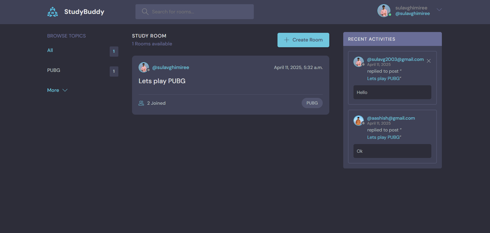

# 📚 StudyBud

StudyBud is a Django-based web application designed to bring students together in virtual rooms for collaboration, discussion, and study. Users can create accounts, join rooms, participate in conversations, and build a study community.

---

## 🌐 Features

- 🔐 User Authentication (Login, Logout, Signup)
- 💬 Create & Join Rooms
- 🗣️ Real-time-style Chat System (refreshed via page reload)
- 🏷️ Room Topics/Categories
- 👤 User Profiles
- 📝 Update/Delete Own Rooms & Messages
- 🔍 Search Rooms by Topic, Name, or Description

---

## 🚀 Tech Stack

- **Backend:** Django (Python)
- **Frontend:** HTML, CSS, JavaScript (Django Template Engine)
- **Database:** SQLite (default, easy to replace with PostgreSQL/MySQL)
- **Authentication:** Django built-in auth system

---

## 📸 Screenshots

---

## ⚙️ Installation

1. **Clone the repository**  
   git clone https://github.com/sulavghimiree/Study_Bud
   cd Blogs_Django

2. **Create a virtual environment**  
   python -m venv venv  
   source venv/bin/activate # On Windows: venv\Scripts\activate

3. **Install the dependencies**  
   pip install -r requirements.txt

4. **Apply migrations**  
   python manage.py migrate

5. **Create a superuser (for admin access)**  
   python manage.py createsuperuser

6. **Run the development server**  
   python manage.py runserver

7. **Visit http://127.0.0.1:8000 to see the app in action!**
